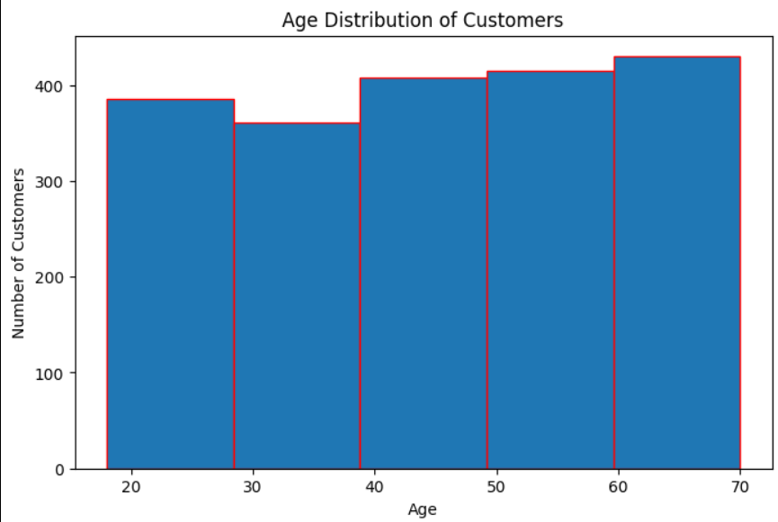
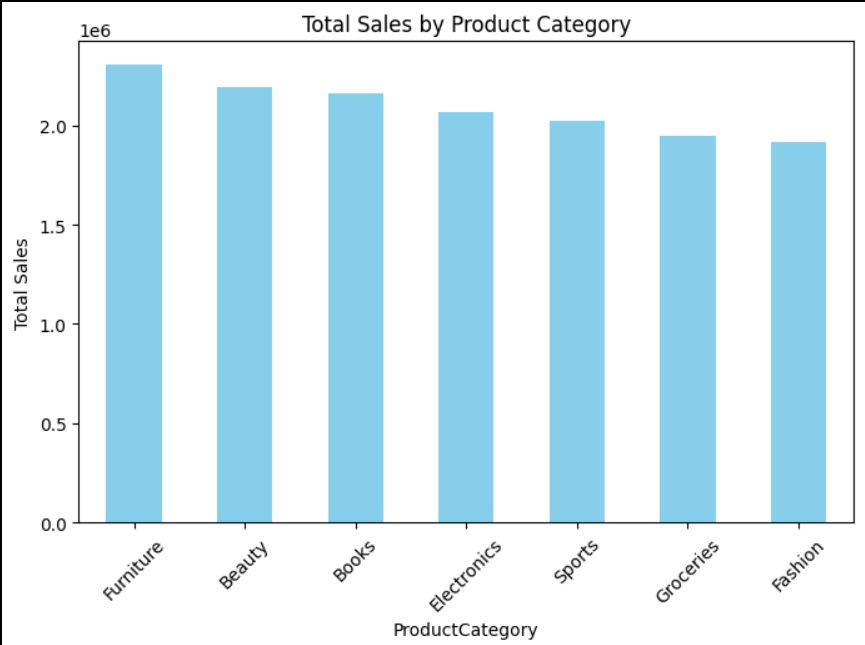
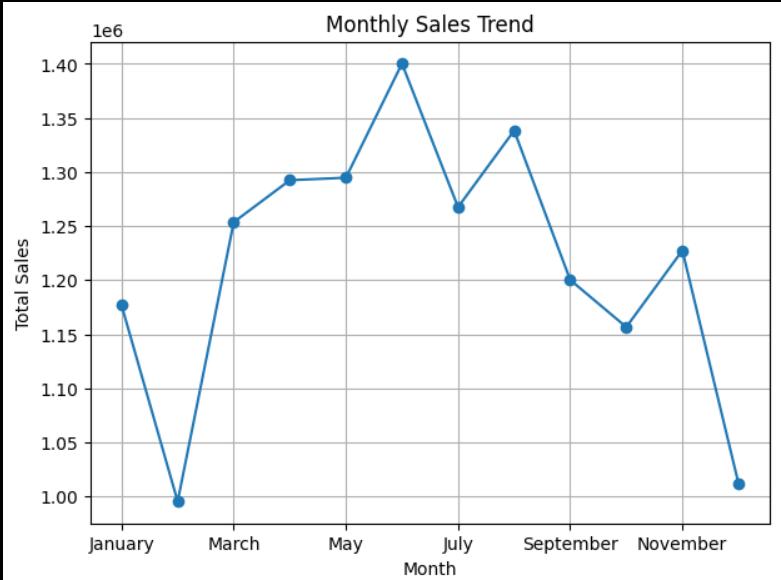
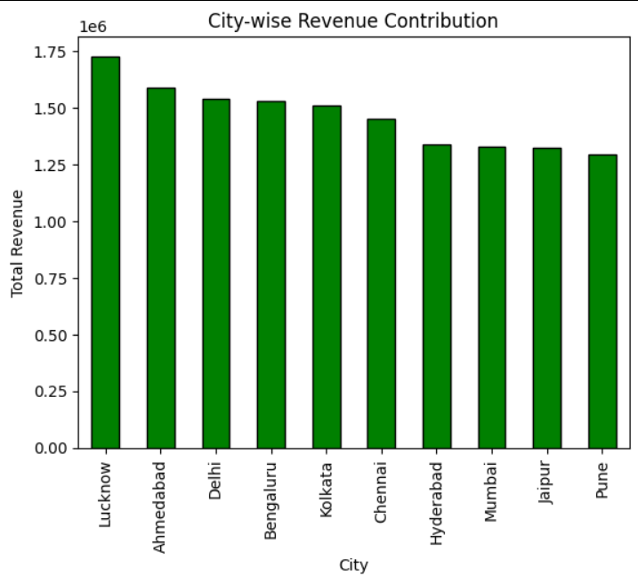

# 🛒 Retail Transactions Analysis – Data Preprocessing & Visualization

## 📌 Project Overview

This project focuses on data inspection, cleaning, preprocessing, and exploratory data analysis (EDA) of a retail dataset.
The dataset contains 2000 customer transactions with 11 columns.

The goal is to prepare a cleaned dataset (Retail_Cleaned.csv) and generate insights through EDA for further modeling.

---

## 📂 Dataset Information

File: `Retail_Transactions_2000.csv`

| Column          | Description                                                |
| --------------- | ---------------------------------------------------------- |
| TransactionID   | Unique ID for each transaction                             |
| CustomerID      | Unique ID for customers                                    |
| Gender          | Male/Female/Other                                          |
| Age             | Age of the customer                                        |
| City            | City where purchase happened                               |
| ProductCategory | Category of product purchased (Electronics, Fashion, etc.) |
| Quantity        | Units purchased                                            |
| Price           | Price per unit (₹)                                         |
| TotalAmount     | Derived (Quantity × Price)                                 |
| PurchaseDate    | Date of purchase                                           |
| PaymentMode     | Cash, Card, UPI, Wallet                                    |

---

## 🛠 Part A: Data Preprocessing

### 1. Data Inspection

* Checked dataset shape, columns, and data types.
* Identified missing values, duplicates, and inconsistent entries.

### 2. Handling Missing Data

* Replaced missing **Age** with mean/median.
* Filled missing **City** with mode (most frequent city).
* Dropped rows with missing **TransactionID** or **ProductCategory**.

### 3. Data Cleaning

* Removed duplicate transactions.
* Standardized categorical values (e.g., "male", "MALE" → "Male").
* Corrected negative/zero values in `Quantity` and `Price`.

### 4. Feature Engineering

* Derived `TotalAmount` if missing.
* Extracted **Month** & **DayOfWeek** from `PurchaseDate`.
* Created **AgeGroup** buckets:

  * 18–25, 26–40, 41–60, 60+

### 5. Encoding & Transformation

* Encoded categorical variables (`Gender`, `City`, `ProductCategory`, `PaymentMode`).
* Normalized numerical features (`Age`, `Price`, `TotalAmount`) where required.

### 6. Final Verification

* Ensured dataset is clean & consistent.
* Exported final file as **`Retail_Cleaned.csv`**.

---

## 📊 Part B: Data Visualization

### 1. Customer Demographics

* 📌 Age distribution (histogram).
* 📌 Gender distribution (bar chart).
* 📌 Top 10 cities by customer count.

### 2. Sales Insights

* 📌 Total sales by product category (bar chart).
* 📌 Monthly sales trend (line chart).
* 📌 Payment mode usage (pie chart).

### 3. Advanced Insights

* 📌 Average spend per customer by age group.
* 📌 City-wise revenue contribution (bar chart).
* 📌 Heatmap of Product Category vs Payment Mode.

## 🚀 Tools & Libraries Used

* **Python**: Pandas, NumPy, Matplotlib, Seaborn, Plotly
* **Data Cleaning**: Pandas

---

## 📈 Key Outcomes

* Cleaned dataset ready for further ML/analytics use.
* Insights into:

  * Most popular product categories & payment modes.
  * Seasonal/Monthly sales trends.
  * City-wise contributions.
  * Customer demographics & spending behaviour.

---

## 📌 Deliverables

* ✅ `Retail_Cleaned.csv` (processed dataset)
* ✅ Preprocessing Python script (`retail_analysis.py`)
* ✅ Visualization scripts / notebook

---

## 📊 Sample Visuals

 **Age & Gender Distribution**
 
 **Sales by Product Category**
 
 **Monthly Sales Trend**
 
 **City-wise Revenue Contribution**
 

---

✨ **This project demonstrates end-to-end preprocessing & visualization for real-world retail data.**

